<h1 align="center">
  

  Marketplace
</h1>

<p align="center">
  

  

  
  
  <a href="https://github.com/PabloXT14/marketplace/commits/master">
    
  </a>
    
   

   <a href="https://github.com/PabloXT14/marketplace/stargazers">
    
  </a>
</p>

<p>
  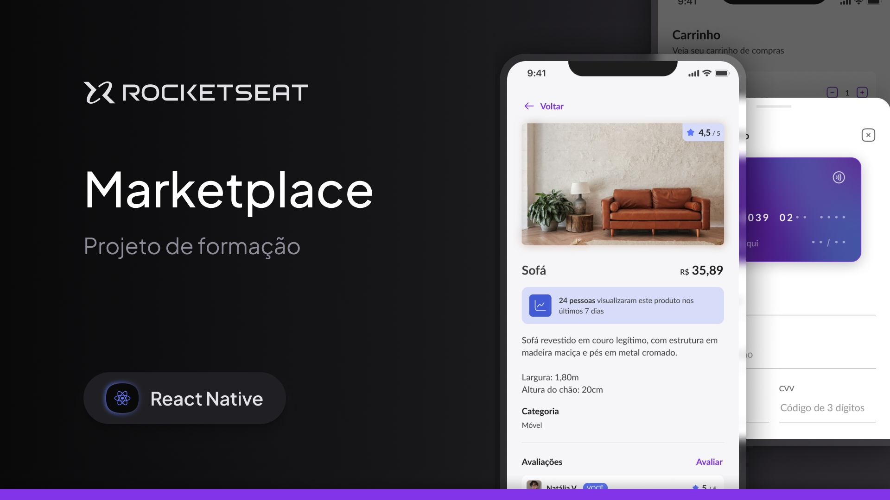
</p>

<p align="center">
 <a href="#-about">Sobre</a> | 
 <a href="#-layout">Layout</a> | 
 <a href="#-setup">Setup</a> | 
 <a href="#-technologies">Tecnologias</a> | 
 <a href="#-license">Licença</a>
</p>


## 💻 Sobre

O **Marketplace** é um aplicativo mobile construído com React Native + Expo que simula um e-commerce completo. Os usuários podem se autenticar, explorar anúncios de produtos com filtros avançados, visualizar detalhes dos produtos, adicionar itens ao carrinho, escolher cartões de crédito e finalizar pedidos. O app também permite acompanhar o histórico de compras e avaliar produtos através de comentários.

Principais pontos de aprendizagem e implementação:
- Consumo de uma API própria (`fastify` + `type-orm`) com `axios` e interceptors para refresh de token;
- Organização de navegação com `expo-router` (fluxos público e privado + tabs);
- Estado global com `zustand` (sessão, carrinho e filtros) e `react-query` para cache de requisições;
- Componentização de formulários com `react-hook-form` + `zod` e estilização com `nativewind`.


## 🎨 Layout

Você pode visualizar o layout base do projeto através [desse link](https://www.figma.com/community/file/1552434564673033742/marketplace). É necessário ter conta no [Figma](https://www.figma.com/) para acessá-lo.

A seguir, veja uma demonstração das principais telas da aplicação:

### Splash

<p align="center">
  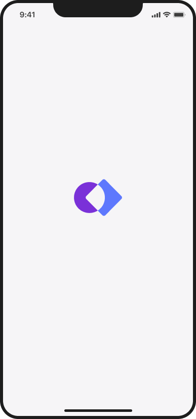
</p>

### Login

<p align="center">
  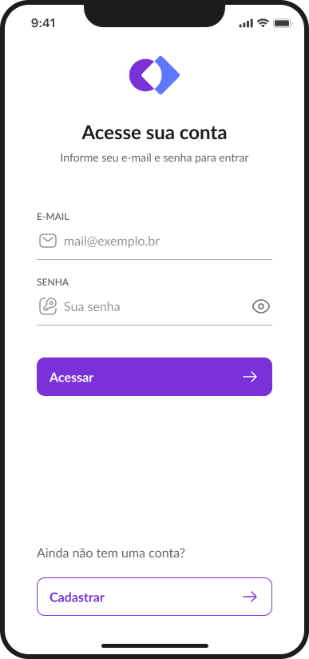
</p>

### Registro

<p align="center">
  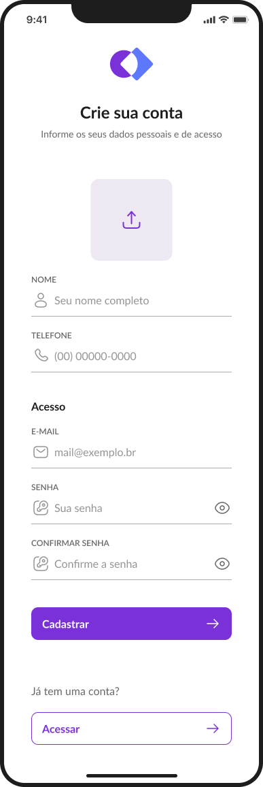
</p>

### Home

<p align="center">
  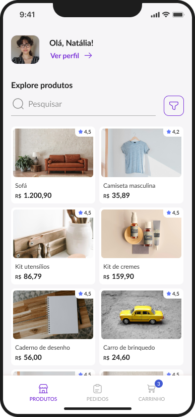
</p>

### Filtros

<p align="center">
  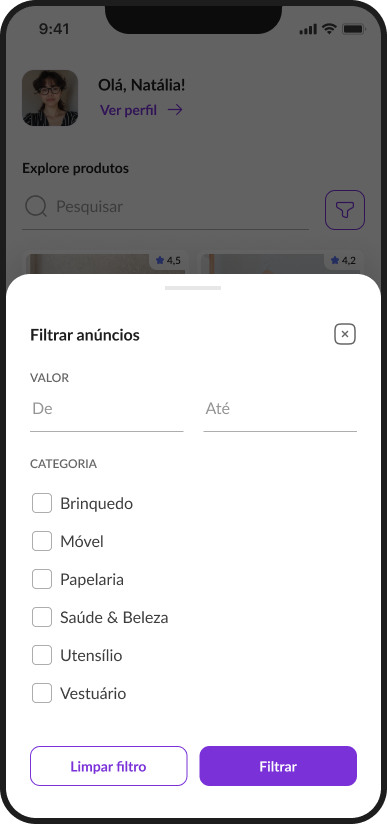
</p>

### Produto

<p align="center">
  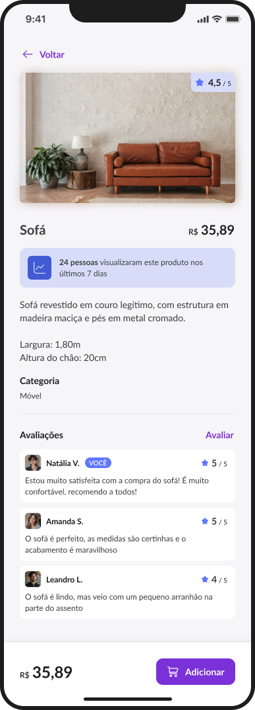
</p>

### Feedback

<p align="center">
  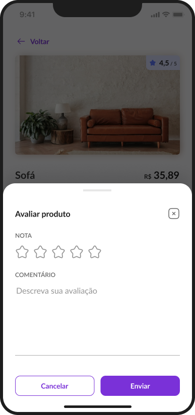
</p>

### Carrinho Vazio

<p align="center">
  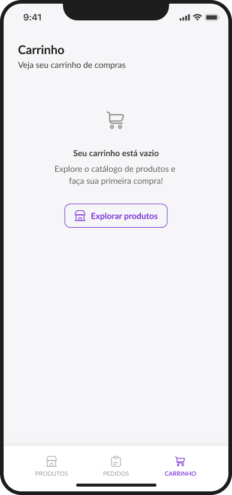
</p>

### Carrinho com Produtos

<p align="center">
  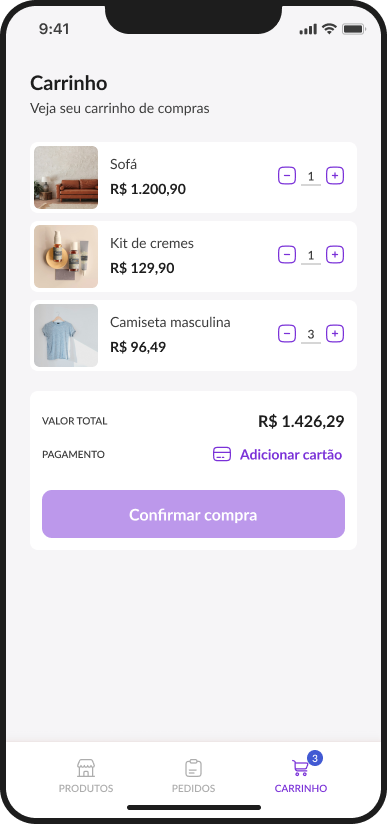
</p>

### Cartão de Crédito

<p align="center">
  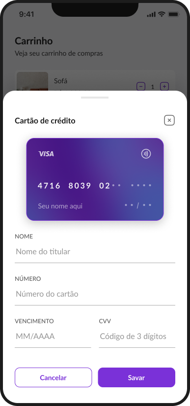
</p>

### Pagamento

<p align="center">
  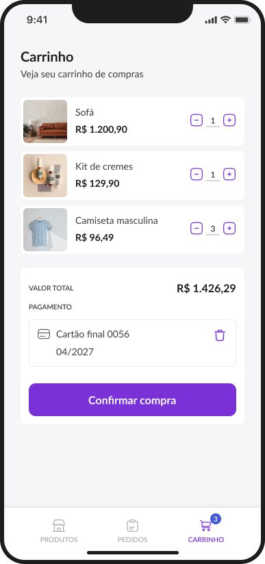
</p>

### Pedidos Vazio

<p align="center">
  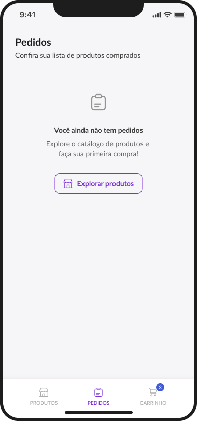
</p>

### Pedidos com Produtos

<p align="center">
  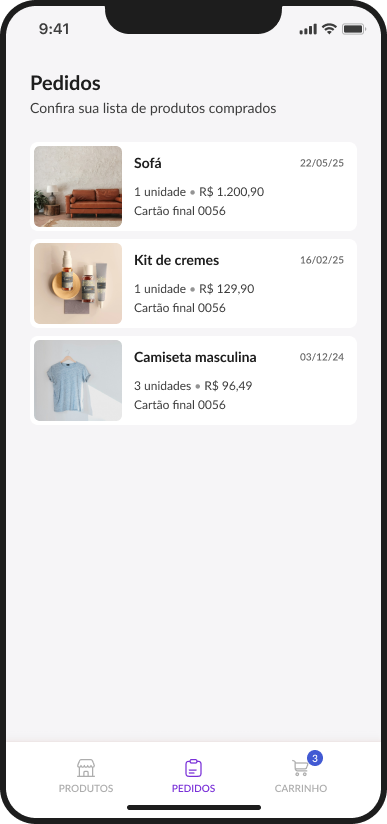
</p>

### Perfil

<p align="center">
  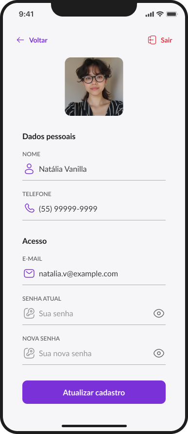
</p>


## ⚙ Setup

### 📝 Pré-requisitos

Antes de começar você precisa ter instalado em sua máquina:

* [Git](https://git-scm.com)
* [Node.js](https://nodejs.org/en/) (>= 18)
* [NPM](https://www.npmjs.com/) ou [Yarn](https://yarnpkg.com/)

Além disso recomendamos o uso do [VSCode](https://code.visualstudio.com/) ou editor de sua preferência.

### Clonando o repositório

```bash
# Clone este repositório
$ git clone git@github.com:PabloXT14/marketplace.git

$ cd marketplace
```

### Backend (API)

```bash
# Acesse a pasta da API
$ cd api

# Instale as dependências
$ npm install

# Crie o arquivo .env baseado em .env.example (ajuste credenciais, banco etc.)

# Execute as migrations
$ npm run migration:run

# Inicie a API
$ npm run dev
```

> Por padrão a API sobe em `http://localhost:3001` e expõe a documentação em `http://localhost:3001/docs`.

### Aplicativo mobile

```bash
# Volte para a raiz e acesse o app mobile
$ cd ../mobile

# Instale as dependências
$ npm install

# Opcional: ajuste o arquivo src/shared/api/marketplace.ts para apontar o BASE_URL
# para o IP local da sua máquina/servidor

# Execute o build necessário para rodar em dispositivos/emuladores nativos
$ npx expo prebuild

# Rode em Android ou iOS
$ npx expo run:android
$ npx expo run:ios
```

Durante o desenvolvimento você também pode utilizar `npx expo start` para rodar o Metro bundler.


## 🛠 Tecnologias

Principais ferramentas utilizadas no projeto:

- **[React Native](https://reactnative.dev/)**
- **[Expo](https://expo.dev/)**
- **[TypeScript](https://www.typescriptlang.org/)**
- **[Expo Router](https://expo.dev/router)**
- **[NativeWind](https://www.nativewind.dev/)**
- **[React Hook Form](https://react-hook-form.com/)**
- **[Zod](https://zod.dev/)**
- **[React Query](https://tanstack.com/query/latest)**
- **[Zustand](https://zustand-demo.pmnd.rs/)**
- **[Axios](https://axios-http.com/)**
- **[Bottom Sheet](https://github.com/gorhom/react-native-bottom-sheet)**
- **[Expo Image Picker](https://docs.expo.dev/versions/latest/sdk/imagepicker/)**
- **[Async Storage](https://docs.expo.dev/versions/latest/sdk/async-storage/)**
- **[Fastify](https://fastify.dev/)**
- **[TypeORM](https://typeorm.io/)**

> Para mais detalhes das dependências gerais da aplicação mobile veja o arquivo `mobile/package.json`.

> Para mais detalhes das dependências da API back-end veja o arquivo `api/package.json`.


## 📝 Licença

Este projeto está sob a licença MIT. Consulte o arquivo [LICENSE](./LICENSE) para mais informações

<p align="center">
  Feito com 💜 por Pablo Alan 👋🏽 <a href="https://www.linkedin.com/in/pabloalan/" target="_blank">Entre em contato!</a>
</p>
